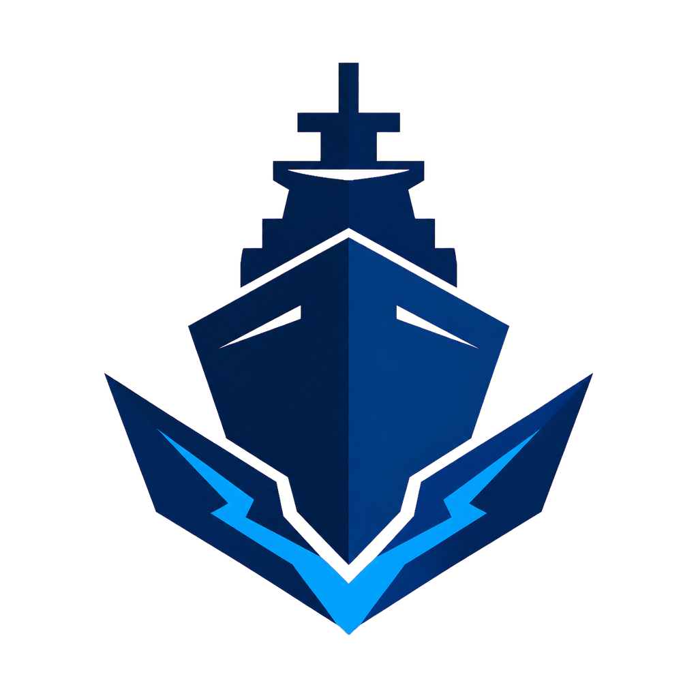

<a id="english"></a>

# WoWS Toolbox

**English** · [한국어](#korean)



WoWS Toolbox is an unofficial Windows desktop application for selecting, extracting, assembling, and inspecting ship models from locally installed World of Warships-family clients.

It provides a graphical workflow for users who do not want to work from a command line. The application exports editable OBJ/MTL models, keeps ship parts as separate objects where the source data allows it, and includes an offline 3D and armor viewer.

> [!IMPORTANT]
> WoWS Toolbox is not endorsed by, sponsored by, or affiliated with Wargaming Group Limited, Lesta Games, their licensors, or their affiliates. Game assets remain the property of their respective owners. See [Legal and asset rights](#legal-and-asset-rights).

## Supported game installations

- World of Warships: Legends on Steam
- World of Warships for PC
- World of Warships Blitz prepared local data
- Korabli

For WoWS Blitz, select a prepared data root containing `full_bundle` (or
`bundle`), the account's downloaded `main.*.net.wargaming.wows.blitz.obb`,
and optionally `DesignData` for localized catalog names. The toolbox never
modifies the emulator or those source files.
[Detailed WoWS Blitz setup and extraction guide](docs/WOWS_BLITZ_GUIDE.md) ·
[한국어 가이드](docs/WOWS_BLITZ_GUIDE_KO.md)
The selected game directory is treated as read-only. WoWS Toolbox writes caches and exported models outside the game installation.

## Main features

- Search ships by in-game name, nation, class, tier, or internal code
- Queue multiple ships for unattended extraction
- Export hull, superstructure, main battery, secondary battery, anti-aircraft weapons, and other resolved parts
- Preserve editable OBJ object groups instead of merging the entire ship into one mesh
- Export OBJ, MTL, and local base-color texture files without requiring Blender
- Inspect models in the built-in offline WebView2/Three.js viewer
- Select, hide, isolate, move, reset, and undo part edits in the viewer
- Display exact armor thickness metadata when the selected client exposes it
- Show or hide the grid, background, waterline, wireframe, and armor overlays
- Compare two extracted models
- Use Korean or English throughout the main UI, ship picker, viewer, and runtime logs
- Check GitHub Releases at startup and ask before downloading any update
- Run on Windows PowerShell 5.1 or PowerShell 7; PowerShell 7 is preferred when both are installed

English is the default application language for a new installation. It can be changed under **Settings > Interface language**.

## Download and install

1. Open the repository's [Releases](https://github.com/Ch0m1n/WoWS-Toolbox/releases) page.
2. Download the latest `WoWS-Toolbox-Setup-*.exe`.
3. Check the published SHA-256 value before running it.
4. Choose the installer language and optional shortcuts.
5. Select a supported game directory when WoWS Toolbox starts.
6. Refresh the ship catalog, add one or more ships to the queue, run the readiness check, and start extraction.

The installer upgrades an older WoWS Toolbox installation in place. User settings, caches, and exported models are stored separately and are preserved.

Starting with 5.0.31, the app checks GitHub Releases in the background at startup. It asks before downloading, verifies the installer against the SHA-256 digest published by GitHub, then opens the normal interactive installer. Automatic checks can be disabled, and a manual **Check now** button is available under **Settings > Updates**.

The application launcher and installer are currently unsigned. Windows SmartScreen or reputation-based antivirus products may warn about new builds. Release notes should always include a SHA-256 digest.

## Requirements

- 64-bit Windows 10 version 1809 or later
- Windows PowerShell 5.1 or PowerShell 7
- Microsoft Edge WebView2 Runtime for the integrated viewer
- A locally installed, supported game client
- Free disk space for extracted models and textures

The release package includes a private CPython 3.10 runtime, Pillow, UnityPy, and the required open-source texture codecs. Blender and a system Python installation are not required. The installer carries Microsoft's signed WebView2 Evergreen bootstrapper and runs it only when WebView2 is missing.

PC and Korabli extraction can require a compatible Oodle runtime from software the user is entitled to use. WoWS Toolbox does not redistribute proprietary Oodle libraries.

## 5.0.67 Legends collaboration-appearance hotfix

- Reads direct base .model -> authored .model replacement tables used by
  Azur Lane and other collaboration exteriors, including hull, live weapon,
  destroyed, and action-helper models.
- Treats camo_white_tint2 as an authored-model routing marker instead of
  painting every ship part with a flat white material texture.
- Audited 87 active ship records across 84 replacement-table exteriors in the
  current Legends client. Four targets absent from the installed client are
  reported and skipped without breaking the rest of the ship extraction.
- Re-extracted AL Fusou with the authored JSB053 hull and JGM662/663 guns:
  61 distinct base-color maps, zero global white overrides, and full pipeline
  acceptance.
- Treats matCamo DDS files such as mat_Golden_tint and mat_SteelStyle2021 as
  game-shader layers, never as global replacements for every albedo and MG map.
- Preserves per-part authored textures for special appearances including
  Mecklenburg G and Aki SE, preventing the flat gold/white regression.

## 5.0.66 Legends default-camouflage extraction

- Reads each ship's active GameParams exterior and now supports Permoflage and
  Trophy records in addition to Skin records.
- Identifies special material styles and bakes standard RGB camouflage masks
  into the final OBJ base-color textures.
- Resolves ship-specific masks even when multiple ships share the same hull
  texture, including Shinonome's Fubuki-based hull.
- Identified and audited all 127 active special-material appearances in the
  current Legends client.

## 5.0.65 Legends rigid-part placement hotfix

- Preserves each non-skinned, single-palette ModelUber render set's authored
  visual-node world transform instead of flattening it at the model root.
- Bakes positions, inverse-transpose normals, and mirrored winding in component
  coordinates, fixing the same rigid-node class without ship-specific offsets.
- Fixes both forward and aft Nanuchka Nihrom radar grids and rotating
  assemblies, which were 0.03335 m too low, while leaving correct radar roots
  and mount points unchanged.
- Live re-extraction passed all 24 models, 38 render sets, and 52 editable
  objects with no missing geometry or material maps.

## 5.0.64 Legends modern-era catalog hotfix

- Adds the six installed `modernEra` ships: A. Burke, Nanuchka, Neustrashimy,
  O.H. Perry, Sovremenny, and Ticonderoga.
- Accepts only live `PX` GameParams ships explicitly marked `modernEra`, keeping
  unrelated event variants out of the ordinary Legends catalog.
- Derives nation and class from each exact live Hull model path, so Ticonderoga
  is classified as a U.S. cruiser instead of the generic `PXSD` key class.
- Advances the Legends cache schema to v4 so an existing 714-row v3 cache is
  automatically replaced by the current 720-row catalog after upgrading.

## 5.0.63 PC/Korabli Blender solid-shading hotfix

- Decodes current PC/Korabli packed vertex normals as offset-binary bytes
  (`0..254`, with `127` as zero) instead of signed bytes. This prevents large
  hull sections from receiving unrelated lighting in Blender's ordinary Solid/Combined view.
- Reverses triangle winding after the BigWorld-to-glTF handedness conversion,
  keeping front faces and vertex normals consistent in both GLB and OBJ output.
- Live re-extraction and Blender 3.5 validation of Aragón, Andalucía, and
  Almte. Oquendo raised mean face/normal agreement from about 0.28–0.34 to
  0.93–0.95 without requiring the Diffuse Color render pass.

## 5.0.62 WoWS Blitz placement and Legends watchdog hotfix

- Converts every WoWS Blitz part placement through the same X-reflected basis
  UnityPy uses for OBJ mesh vertices. This fixes anti-aircraft mounts and other
  equipment appearing on the opposite side of ships such as Wasp and San
  Francisco.
- Audits all 734 unique body bundles behind the current 756 supported records:
  671 require the corrected placement basis, 63 are unchanged, and none failed
  inspection. Corrected Wasp and San Francisco exports were also checked in the
  built-in viewer.
- Limits Legends native component conversion to two below-normal-priority
  workers and gives each component a 300-second timeout, preventing ships such
  as Tennessee and Soobrazitelny from repeating the same heartbeat indefinitely
  while heavily loading Windows and Explorer.
- Terminates the complete child-process tree after cancellation or timeout and
  reports the active count, oldest model, and elapsed time in progress logs.

## 5.0.61 WoWS Blitz weapon-texture hotfix

- Recursively resolves texture CABs referenced by loaded weapon materials,
  instead of stopping at the body bundle's direct dependencies. This prevents
  affected main, secondary, and anti-aircraft mounts from exporting white.
- Follows only material slots used by the selected ship and stores discovered
  CAB locations in the existing Blitz cache for later extractions.
- Live re-extraction of Yellowstone, Yosemite, and Schwertleite produced an
  albedo PNG and MTL `map_Kd` for every material used by their OBJ files.

## 5.0.60 WoWS Blitz model extraction

- Adds WoWS Blitz as a fourth GUI source using a prepared local data root with
  downloaded ship AssetBundles, the user's base OBB, and optional DesignData.
- Builds a localized 964-record ship catalog; the validated data set exposes
  756 ships backed by currently downloaded body resources and includes each
  available default, `paint_01`, and `paint_02` variant.
- Combines body bundles with shared gun, misc, animation, shader, and ship-model
  dependencies from the base OBB, then exports editable OBJ groups, MTL
  materials, and albedo/normal/metallic texture PNGs without Blender.
- A cold dependency lookup was reduced from about 80.8 seconds to 4.4 seconds
  by prioritizing the five predictable bundles before a full OBB scan.
- Live validation exported Iowa as 51 parts / 22,950 vertices / 15,124 faces /
  18 textures and Mecklenburg `paint_01` as 45 parts / 43,637 vertices /
  27,449 faces / 22 textures. Both outputs passed invalid-number and missing-map
  checks; the Mecklenburg OBJ also loaded as 45 independently editable viewer
  parts without browser errors.
- Bundles UnityPy and only the open-source mesh/texture codec dependencies
  required by the extractor. WoWS Blitz game data and the optional FMOD audio
  converter are not included.
## 5.0.59 viewer texture-cache and interaction hotfix

- Fixes duplicate asynchronous image requests used by materials that reference the same PNG as both `map_Kd` and `map_d`.
- Prevents an undefined cached `ImageBitmap` from stopping the WebGL render loop, which left some materials dark or incomplete and made camera/part movement appear unresponsive.
- Live Mecklenburg G validation loaded all 508 parts and 93 materials in both default and detailed PBR modes with zero invalid textures or browser errors; part move and undo remained visible while render frames continued advancing.

## 5.0.58 partial native-exterior hotfix

- Accepts linked Legends `Exterior`/`Skin` records that only specify a runtime material tint and do not replace `A_Hull` or hardpoint models. The exporter keeps the selected base hull instead of aborting the queue item.
- Fixes Incomparable SE failing with `PBES709_INCOMPARABLE_EXCLUSIVE has no A_Hull model` and records its `mat_SteelStyle2021` material style in the assembly metadata.
- Live Incomparable SE validation resolved 99/99 combat hardpoints and 610/610 authored misc placements, converted 83 PBR models and 116/116 render sets, and assembled 757 editable objects with 440 textures and no missing map.
## 5.0.57 Legends native exterior and nested-mount fix

- Applies the default `Exterior`/`Skin` record linked by Legends GameParams instead of exporting the shared undressed module hull. Mecklenburg G now uses its dedicated `GSB423_Mecklenburg_Birthday_26` hull, `GGM3162` main guns, `GGS3163` secondary guns, and golden texture set automatically.
- Composes turret-mounted AA hardpoints from the parent's raw attachment transform, keeping mesh-axis correction out of authored child coordinates. The four AA mounts on Mecklenburg G's second and third turrets are no longer mirrored toward the opposite side of the turret.
- Live Mecklenburg G validation resolved all 68 combat hardpoints and converted 67 models, 116 render sets, 508 editable objects, and 306 textures without a missing model, render set, or map.
- Clarifies in the Legends UI that selectable camouflage variants remain unavailable while each special ship's authored appearance and dedicated models are applied automatically.

## 5.0.56 faster model viewer loading

- Deduplicates repeated MTL texture references and shares identical decoded images and material variants across independently editable parts.
- Loads only albedo and alpha channels for the initial model view. Normal, roughness, and AO textures are loaded on demand when **Detailed PBR preview** is enabled, while the unused legacy specular map is no longer decoded.
- Uses asynchronous `ImageBitmap` decoding with a safe `TextureLoader` fallback and avoids cloning geometry that `OBJLoader` already owns uniquely.
- In the same headless Edge test, the 519-part Mecklenburg G viewer load dropped from 131.7 s to 21.8 s (about 83% faster), resource requests from 262 to 55, and the longest main-thread stall from 87.2 s to about 1.0 s. Deferred PBR channels loaded in about 3.4 s.

## 5.0.55 faster lossless extraction

- Runs lossless PNG compression in a bounded four-worker pool and reuses a decoded-pixel texture cache across later PC/Korabli exports without hard-linking editable outputs.
- Caches resolved PBR source selections and extracts independent package chunks in parallel, eliminating repeated alias scans while preserving the exact decoded texture pixels.
- Extracts independent Legends resources with four bounded workers while preserving deterministic CRC records and output order.
- Live Patrie timing dropped from 105.7 s to 46.9 s with a cold PBR cache and from 26.7 s to 7.5 s on a repeated export. A 234-resource Legends extraction dropped from 23.3 s to 15.9 s.
## 5.0.54 lossless output optimization and nested Legends mounts

- Reduces full-resolution PC/Korabli OBJ packages by removing same-role duplicate textures, publishing scalar PBR channels as lossless grayscale PNGs, and using maximum lossless PNG compression. A live Patrie extraction dropped from 213.2 MB to 88.7 MB without changing OBJ geometry or decoded texture pixels.
- Resolves hash-only base-image names through their associated material names so PBR maps are not silently omitted, and versions negative/conversion caches when the channel contract changes.
- Resolves recursively nested Legends hardpoints such as AA guns mounted on main-gun turrets. The live Mecklenburg G extraction now resolves all 68 combat hardpoints and completes its full OBJ/PBR pipeline.
- Expands PC/Korabli camouflage selection, preserves alternate color schemes, and localizes camouflage names to the active application language.
- Expands the Legends catalog from the selected client resources instead of the previous incomplete subset.
## 5.0.53 readable texture filenames

- Publishes final PC, Korabli, and Legends texture files with readable material/part names and explicit channel suffixes such as `_albedo`, `_normal`, `_ao`, `_roughness`, and `_metalness`.
- Uses `_02`, `_03`, and later numeric suffixes only when readable names collide; SHA-256 names remain confined to the internal deduplication cache.
- Rewrites OBJ/MTL/PBR references to the readable files and writes `texture_manifest.json` with the original source identifier and SHA-256 for diagnostics.
- Falls back from hash-only source names to the associated material name so third-party OBJ tools can load textures without opaque cache filenames.

## 5.0.52 cleaner Legends export folders

- Publishes every validated Legends OBJ package directly in its ship output folder, including the OBJ, MTL, model/validation sidecars, and `textures` directory.
- Removes the extra `scene` level and reproducible `generated`, `extracted`, and `pbr` intermediates after a successful export.
- Moves pipeline logs and the internal manifest to `%LOCALAPPDATA%\WoWSToolbox\Diagnostics\Exports` so normal model folders contain only files users actually open.
- Keeps failed or incomplete extraction folders intact for troubleshooting and leaves all existing exports unchanged.
## 5.0.51 deterministic surface modes and camouflage-cache repair

- Makes **Albedo inspection** and **Detailed PBR preview** mutually exclusive. Turning albedo inspection off now always returns to the uniform default surface view instead of revealing a hidden directional-lighting state.
- Migrates legacy viewer settings by discarding the old invalid state where both inspection modes were enabled.
- Adds an explicit camouflage-catalog schema marker so cached PC and Korabli ship lists with empty legacy camouflage arrays are rebuilt once.
- Restores all eight permanent camouflage choices linked to the current PTS Vanadis record, while keeping "No camouflage · Default appearance" as the default selection.
- Verifies the catalog contract against the live PTS data and covers the new viewer mode state in self-tests.
## 5.0.50 per-ship permanent-camouflage locker

- Adds a **Paint locker** to the ship picker and always defaults every ship to `No camouflage · Default appearance`.
- Lists only the permanent camouflages actually linked to the selected PC or Korabli ship, using both the translated display name and a stable internal ID to distinguish multiple or similarly named paints.
- Stores one camouflage choice per ship, keeping queue entries, output folders, and extraction caches isolated from one another.
- Persists camouflage ID, name, and scheme in saved queue files while loading older queue files safely as the default appearance.
- Resolves the exact Vehicle record for event and collaboration ships that share a model directory, preventing another ship's camouflage or weapon layout from being selected.
- Keeps Legends on its verified default appearance until trustworthy per-ship permanent-camouflage links are available.
- Verifies the workflow with a real PC Aki G `Skyward Grace` export and the complete nine-stage self-test suite.

## 5.0.49 double-sided armor and detail-preserving permanent camouflage

- Renders armor plates from both sides so a selected plate remains visible from below and from internal camera positions.
- Keeps armor depth testing, depth writing, and deterministic single-pass transparency, so nearer plates still occlude hidden armor.
- Composites tiled permanent-camouflage paint over the original high-resolution albedo instead of replacing it with a tiny color tile.
- Preserves the base surface detail and alpha while applying the camouflage scheme's UV scale and offset during baking.
- Invalidates old ship GLB caches through the updated exporter fingerprint, preventing reuse of previously flattened camouflage output.
- Verifies the change with a texture-compositing unit test, a release exporter build, a real New Jersey viewer regression, and the complete nine-stage self-test suite.

## 5.0.48 permanent camouflage export and armor reference control

- Adds a persistent **Reference ship opacity** control for the desaturated exterior shown behind armor, independently from armor-plate opacity.
- Adds **Ship permanent camouflage** extraction for PC and Korabli ships. The exporter resolves the selected ship's own permanent camouflage and promotes it to the default OBJ/MTL material set.
- Preserves `KHR_texture_transform` UV offset, scale, rotation, and texture-coordinate selection while converting native GLB data to OBJ.
- Separates default-paint and permanent-camouflage caches so switching paint modes cannot reuse a stale model.
- Verifies the workflow with a native Aki permanent-camouflage export, synthetic UV-transform coverage, and a real Aragón armor-view browser regression.
- Keeps Legends on its verified default-paint extraction path until its separate assembly format exposes an equally reliable camouflage contract.

## 5.0.47 uniform inspection lighting and clearer armor context

- Uses an unlit base-color material in normal model mode and applies one shared studio brightness gain to every OBJ part, preventing normals, mirrored surfaces, and separate part origins from creating false two-tone paint.
- Keeps exposure, key-light, and environment-light controls responsive without making their normal-view result directional; **Detailed PBR preview** remains the explicit directional-lighting mode.
- Keeps **Albedo inspection** as the raw, tone-mapping-free texture diagnostic.
- Raises the non-occluding armor-context ship visibility slightly while preserving armor depth testing and depth writing, so the exterior remains readable without hiding internal plates.
- Verifies the complete mode cycle with a real 74-part Aragón export: uniform normal lighting, raw albedo, opt-in PBR, armor depth, and model restoration.
## 5.0.46 balanced armor context and responsive lighting

- Restores a neutral, light-responsive material for normal model viewing, so exposure, key-light, and environment-light controls affect the ship again.
- Makes **Albedo inspection** an explicit unlit diagnostic mode; switching it off restores the neutral lit material, while **Detailed PBR preview** remains a separate opt-in mode.
- Keeps a faint, desaturated ship exterior in armor mode for spatial reference without writing that reference shell to the depth buffer.
- Continues to write visible armor plates to depth, so the nearest deck, barbette, belt, or bulkhead correctly hides armor behind it while filters no longer leave an unexplained floating block.
## 5.0.45 physically occluding armor transparency

- Keeps armor opacity adjustable while writing every visible plate to the depth buffer.
- Makes the nearest deck, belt, turret face, or bulkhead hide armor behind it instead of blending the entire armor stack like an X-ray view.
- Preserves front-face armor rendering and complete isolation from the regular textured ship model.
- Adds real extracted-ship browser checks for armor depth testing, depth writing, and the occlusion material contract.

## 5.0.44 armor isolation, neutral paint, and Legends diagnostics

- Hides every regular ship mesh while armor mode is active, so hull paint and superstructure textures cannot block the internal armor layout.
- Uses the original base-color texture through an unlit paint material in normal model mode. Directional PBR lighting is now opt-in instead of altering the default paint.
- Restores the exact pre-armor mesh visibility when returning to model mode.
- Shows the discovered and fully assemblable Legends catalog counts separately; 468 displayed ships can be the supported subset of 995 discovered records.
- Emits child-process start, heartbeat, completion, elapsed-time, and log-path diagnostics during Legends assembly so a slow or stalled step is identifiable.
- Validates normal paint, optional PBR, isolated armor, and model restoration with a real extracted ship in a browser regression test.

## 5.0.42 GM3D-compatible materials and isolated PBR channels

- Matches the default OBJ material contract against a GM3D Aki G reference export.
- Uses `_a` for base paint, `_mg`.R as a grayscale specular map, `_n` for normals, and `_ao` for ambient occlusion in generic OBJ viewers.
- Preserves detailed roughness and metalness maps as Toolbox-specific MTL comments so generic importers do not turn painted parts metallic or create false two-tone surfaces.
- Selects the highest-information AO channel for indexed Korabli materials, including assets that store AO in G instead of R.
- Validates a real Aki G export and all material-channel registrations with a Chromium-based MTL loader test.

## 5.0.41 source-accurate surfaces and Legends assembly repair

- Resolves event and collaboration ships by their exact GameParams record, preventing shared model-directory siblings such as Aki G and AL Hindenburg from exporting the hull without their weapons.
- Keeps base-color paint in the default viewer material and moves normal, roughness, and AO channels to the optional PBR preview, preventing unrelated parts from turning black or splitting into false two-tone surfaces.
- Resets obsolete low-exposure lighting presets once so upgraded installations open with a neutral inspection setup.
- Prefers Korabli's full `_art` paint atlas and reconstructs narrowly truncated BC7 atlas tails before decoding instead of falling back to 16/32px placeholders.
- Corrects the Legends ModelUber bow-axis conversion, placing main battery, secondary battery, directors, radar, and miscellaneous equipment on their authored hull sections.
- Rebuilds both bundled PC/Korabli exporters and validates PC Aki, Korabli Hanko/Moonsund, and Legends Connecticut against extracted geometry and reference texture statistics.
- External reference archives are used only for local validation and are not included in the repository or release package.
## 5.0.39 extraction integrity and viewer normal repair

- Restores standard Three.js double-sided normal handling. Camera-facing reverse-wound hull, deck, turret, catapult, and superstructure faces no longer turn black under directional lighting.
- Removes the unsafe GLB primitive deduplication pass. Repeated draw calls that share accessors are preserved because they may represent intentional ship geometry.
- Rejects incomplete streamed `.dd0` texture fragments before decoding and falls back only to a decodable DDS payload.
- Resolves nested PC/Korabli visual prototypes to their leaf visual model before export, preventing placeholder or parent assemblies from being emitted as ship parts.
- Rebuilds both bundled PC/Korabli extractors and adds regression contracts for the renderer and native OBJ conversion.
- Revalidates Korabli Moonsund, PC Aki, and Legends Suwo through the current no-Blender pipelines.
## 5.0.38 resizable part inspector and simplified editing

- Makes the model viewer's right inspector width adjustable by dragging its left edge.
- Adds draggable horizontal separators between search/categories, the selected-part card, and the scrolling part list. The layout is remembered per user.
- Wraps category filters into visible rows with their own scrollbar, preventing controls below the search field from being clipped.
- Removes the experimental arbitrary part rotation, weapon traverse, and barrel-elevation controls. They were unreliable for OBJ parts that do not preserve a complete articulated hierarchy.
- Keeps stable inspection actions: move, isolate, hide, reset, Ctrl+Z, and Ctrl+Y.

## 5.0.37 ship surface and texture selection repair

- Restores stable double-sided rendering for every normal ship part. Mixed source winding no longer makes decks, turrets, catapults, or superstructure parts disappear and look like floating rows in the built-in viewer.
- Keeps armor plates front-sided while using a colorless double-sided ship depth proxy, so the near-side armor remains visible without showing the opposite side through the ship.
- Selects base-color textures adaptively: ordinary materials prefer the full `_a` paint texture, while indexed materials use `_art` only when `_a` is a tiny lookup image and `_art` is substantially larger.
- Rebuilds both bundled PC/Korabli extraction binaries with regression tests for ordinary and indexed material layouts.
- Marks exported part pivots explicitly as OBJ-space data and adds viewer/export contract checks.

## 5.0.36 part rotation and movable lighting controls

- Shows X, Y, and Z rotation fields whenever one model part is selected, instead of hiding rotation controls unless the part is recognized as a weapon.
- Keeps weapon traverse on the ship's extracted up axis without discarding rotation on the other two axes.
- Exposes turret traverse and supported barrel elevation in the same selected-part card, with a clear explanation when the OBJ has no independently adjustable barrel geometry.
- Makes the **Lighting & surface** panel draggable by its header, remembers its position, keeps it inside the visible window, and adds a position reset button.
- Preserves Ctrl+Z/Ctrl+Y history for numeric part rotations, traverse, barrel elevation, and reset actions.

## 5.0.35 indexed materials, armor occlusion, and mounted aircraft equipment

- Adds an **Albedo inspection** viewer mode that bypasses lighting and PBR channels, making texture errors distinguishable from lighting.
- Prevents far-side model surfaces and weapon mounts from bleeding through the transparent armor view.
- Exports `airArmament` and `depthCharges` component models, including the two catapults declared by North Dakota's client data.
- Uses the full-resolution `_art` texture for indexed ship materials instead of the tiny `_a` lookup map that made Moonsund appear brick-patterned.
- Removes duplicate primitive references during OBJ conversion and automatically lowers viewer pixel density for unusually dense ships.

## 5.0.34 consistent material preview

- Applies one material policy to hull, superstructure, turrets, secondary and anti-aircraft weapons, radar, catapults, and every other OBJ part.
- Prevents mixed OBJ face winding from flipping lighting normals on the camera-facing side, which could make one painted surface look like two different colors.
- Prioritizes the original base-color texture by default. Extracted normal, roughness, and ambient-occlusion channels remain available through the optional **PBR detail preview** control.
- Uses a broader neutral inspection light and safely releases hidden PBR textures when a model is closed.

## 5.0.33 viewer and PBR update

- Extracts original-size base color plus normal, roughness, metalness, and ambient-occlusion companion textures when the selected client exposes them.
- Keeps the inferred game `_mg` channel in the export while avoiding a misleading metallic preview that made painted turrets appear split into black and white regions.
- Uses a neutral AgX studio rig without hard self-shadowing and exposes lighting and surface-detail controls directly in the viewer inspector.
- Corrects viewer waterline placement for translated ship roots and adds extraction, manifest, and viewer regression checks.

## Quality and format notes

- Legends exports use the verified LOD0 render set and original-size base-color texture policy.
- PC and Korabli honor the requested LOD only when that LOD exists. The extractor reports an error instead of silently substituting a different LOD.
- OBJ/MTL output carries base color and supported PBR companion textures. Proprietary in-game shader behavior is approximated and may not map one-to-one to standard desktop materials.
- Some internal, animated, streamed, or unsupported model formats may not resolve.
- Armor data availability and precision depend on the selected client and build.
- Viewer edits are temporary inspection edits; they are not written back to the source OBJ.

## Repository layout

- `Backend/` — catalog, queue, extraction, native OBJ/GLB conversion, and armor sidecars
- `BlenderExtractor/` — Legends geometry parsing and supporting format code
- `FullAssembly/` — selected-ship resource resolution and part assembly
- `GUI/` — PowerShell/WPF application and localization
- `Viewer/` — offline WebView2/Three.js model and armor viewer
- `Launcher/` — console-free Windows launcher source
- `Installer/` — Inno Setup definition, legal notices, and installer assets
- `Runtime/` — bundled runtime files used by release builds
- `examples/` — sanitized request examples

## Build and test

PowerShell 7 is required for the release scripts.

```powershell
pwsh -NoLogo -NoProfile -File .\Launcher\Build-Launcher.ps1
pwsh -NoLogo -NoProfile -File .\Update-SourceManifest.ps1
pwsh -NoLogo -NoProfile -File .\Run-SelfTests.ps1
pwsh -NoLogo -NoProfile -File .\Build-Release.ps1 -Version 5.0.67 -CreateZip
pwsh -NoLogo -NoProfile -File .\Installer\Build-Installer.ps1
```

Building the installer also requires Inno Setup 6. The build scripts refuse to overwrite an existing release target, validate the launcher version, verify the Microsoft signature and SHA-256 of the WebView2 bootstrapper, and create a release manifest.

## Reporting bugs

Please use the GitHub bug report form and remove personal paths, account names, tokens, and unrelated game files from logs before attaching them. Do not upload extracted models, textures, package files, or other copyrighted game assets.

Security-sensitive reports should follow [SECURITY.md](SECURITY.md).

## Contributing

See [CONTRIBUTING.md](CONTRIBUTING.md). Contributions must not include extracted game assets, proprietary runtime libraries, credentials, or code copied from an incompatible or unlicensed source.

## Legal and asset rights

WoWS Toolbox is an unofficial community project. Its MIT license applies only to WoWS Toolbox code and does not grant rights to use, redistribute, or sell extracted game assets.

Users are responsible for following the applicable game EULA, platform terms, and local law. Do not redistribute or sell extracted assets without permission from the rights holder. See [LEGAL_NOTICE.txt](LEGAL_NOTICE.txt) and [THIRD_PARTY_NOTICES.md](THIRD_PARTY_NOTICES.md).

## License

WoWS Toolbox code is released under the [MIT License](LICENSE). Third-party components remain under their respective licenses.

---

<a id="korean"></a>

# WoWS Toolbox — 한국어

[English](#english) · **한국어**

WoWS Toolbox는 내 PC에 설치된 World of Warships 계열 게임에서 원하는 함선을 골라 파트별 모델로 내보내고, 프로그램 안에서 모델과 장갑을 확인할 수 있는 비공식 Windows 데스크톱 도구예요.

명령줄에 익숙하지 않은 사용자도 GUI에서 함선을 검색하고 여러 척을 대기열에 추가할 수 있어요. 추출 결과는 편집 가능한 OBJ/MTL 형식이며, 원본 데이터가 허용하는 범위에서 함선 부품을 서로 다른 오브젝트로 유지해요.

> [!IMPORTANT]
> WoWS Toolbox는 Wargaming Group Limited, Lesta Games, 해당 라이선스 제공자 또는 계열사가 승인하거나 후원한 도구가 아니며 이들과 제휴 관계가 없어요. 게임 자산의 권리는 각 권리자에게 있어요.

## 지원 게임

- World of Warships: Legends Steam판
- World of Warships PC판
- Korabli

선택한 게임 설치 폴더는 읽기 전용으로 사용해요. 캐시와 추출 모델은 게임 설치 폴더 밖에 저장해요.

## 주요 기능

- 인게임 이름, 국가, 함종, 티어 또는 내부 코드로 함선 검색
- 여러 함선을 대기열에 추가해 순차 추출
- 선체, 상부구조물, 주함포, 부함포, 대공포와 확인된 기타 부품 추출
- 함선 전체를 하나로 합치지 않고 편집 가능한 OBJ 오브젝트 그룹 유지
- Blender 없이 OBJ, MTL과 로컬 기본 색상 텍스처 출력
- 오프라인 WebView2/Three.js 기반 3D 모델·장갑 뷰어
- 파트 선택, 숨김, 단독 보기, 이동, 원위치와 실행 취소
- 지원 게임의 정확한 장갑 두께 표시
- 격자, 배경, 해수면, 와이어프레임과 장갑 오버레이 전환
- 두 추출 모델 비교
- 메인 UI, 함선 선택 창, 뷰어와 실행 로그의 한국어·영어 지원
- 시작할 때 GitHub Releases를 확인하고 사용자 동의를 받은 뒤에만 업데이트
- Windows PowerShell 5.1과 PowerShell 7 지원

새 설치의 기본 언어는 영어예요. **Settings > Interface language**에서 한국어로 바꿀 수 있어요.

## 다운로드와 설치

1. 저장소의 [Releases](https://github.com/Ch0m1n/WoWS-Toolbox/releases) 페이지를 열어요.
2. 최신 `WoWS-Toolbox-Setup-*.exe`를 받아요.
3. 게시된 SHA-256 값과 받은 파일을 비교해요.
4. 설치 언어와 원하는 바로가기를 선택해요.
5. 프로그램을 실행하고 지원되는 게임 설치 폴더를 선택해요.
6. 함선 목록을 새로고침하고 대기열에 함선을 추가한 뒤 준비 검사와 추출을 시작해요.

설치기는 기존 WoWS Toolbox를 제자리에서 업데이트해요. 사용자 설정, 캐시와 기존 추출 모델은 그대로 유지돼요.

5.0.31부터 프로그램을 열면 백그라운드에서 GitHub Releases를 확인해요. 새 버전이 있으면 먼저 업데이트 여부를 묻고, 동의한 경우에만 설치 파일을 받아 GitHub가 게시한 SHA-256과 비교한 뒤 일반 설치기를 열어요. **설정 > 업데이트**에서 자동 확인을 끄거나 **지금 확인**을 누를 수 있어요.

현재 실행 파일과 설치기는 코드 서명이 없어요. Windows SmartScreen 또는 평판 기반 백신이 새 빌드에 경고를 표시할 수 있으므로 릴리스에 적힌 SHA-256 값을 확인하세요.

## 준비물

- 64비트 Windows 10 버전 1809 이상
- Windows PowerShell 5.1 또는 PowerShell 7
- Microsoft Edge WebView2 Runtime
- 로컬에 설치된 지원 게임 클라이언트
- 모델과 텍스처를 저장할 여유 공간

배포본에는 전용 CPython 3.10 런타임, Pillow, UnityPy와 필요한 오픈소스 텍스처 코덱이 들어 있어요. Blender와 시스템 Python은 필요하지 않아요. WebView2가 없으면 설치기가 Microsoft 서명 부트스트래퍼를 실행해요.

PC판과 Korabli 추출에는 사용자가 합법적으로 이용할 수 있는 소프트웨어에 포함된 호환 Oodle 런타임이 필요할 수 있어요. WoWS Toolbox는 독점 Oodle 라이브러리를 재배포하지 않아요.

## 품질과 출력 형식

- Legends는 검증된 LOD0 렌더 세트와 원본 크기 기본 색상 텍스처 정책을 사용해요.
- PC판과 Korabli는 요청한 LOD가 실제로 존재할 때만 사용하며 다른 LOD로 조용히 대체하지 않아요.
- OBJ/MTL은 게임의 모든 독점 셰이더 채널을 완전히 재현하지는 않아요.
- 내부 전용, 애니메이션, 스트리밍 또는 아직 지원하지 않는 형식은 추출되지 않을 수 있어요.
- 장갑 데이터의 제공 여부와 정확도는 선택한 클라이언트와 게임 빌드에 따라 달라요.
- 뷰어 편집은 확인용이며 원본 OBJ 파일에 다시 기록되지 않아요.

## 빌드와 자체 검사

릴리스 스크립트에는 PowerShell 7이 필요해요.

```powershell
pwsh -NoLogo -NoProfile -File .\Launcher\Build-Launcher.ps1
pwsh -NoLogo -NoProfile -File .\Update-SourceManifest.ps1
pwsh -NoLogo -NoProfile -File .\Run-SelfTests.ps1
pwsh -NoLogo -NoProfile -File .\Build-Release.ps1 -Version 5.0.67 -CreateZip
pwsh -NoLogo -NoProfile -File .\Installer\Build-Installer.ps1
```

설치기 빌드에는 Inno Setup 6도 필요해요.

## 버그 신고와 기여

GitHub 버그 신고 양식을 사용해 주세요. 로그를 첨부하기 전 개인 경로, 계정 이름과 토큰을 제거하고, 추출한 모델·텍스처·패키지 파일 같은 저작권 자산은 업로드하지 마세요.

보안 문제는 [SECURITY.md](SECURITY.md), 기여 방법은 [CONTRIBUTING.md](CONTRIBUTING.md)를 확인하세요. 더 자세한 한국어 변경 이력과 사용법은 [README_KO.md](README_KO.md)에 있어요.

## 법적 안내와 라이선스

WoWS Toolbox는 비공식 커뮤니티 프로젝트예요. MIT 라이선스는 WoWS Toolbox 코드에만 적용되며 추출한 게임 자산을 사용·재배포·판매할 권리를 부여하지 않아요.

사용자는 해당 게임 EULA, 플랫폼 약관과 지역 법률을 따라야 해요. 권리자의 허가 없이 추출 자산을 재배포하거나 판매하지 마세요. 자세한 내용은 [LEGAL_NOTICE.txt](LEGAL_NOTICE.txt)와 [THIRD_PARTY_NOTICES.md](THIRD_PARTY_NOTICES.md)를 확인하세요.

WoWS Toolbox 코드는 [MIT License](LICENSE)로 배포해요. 제3자 구성 요소에는 각각의 라이선스가 적용돼요.
